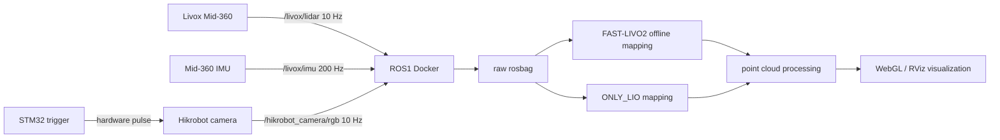

# RK3588 / ELF2 FAST-LIVO2 Reconstruction

<p align="center">
  <b>LiDAR-Visual-Inertial mapping stack for Livox Mid-360, Hikrobot MVS camera, STM32 hardware synchronization, ROS1 Noetic and WebGL visualization.</b>
</p>

<p align="center">
  
  
  
  
  
</p>

This repository collects the source code, launch scripts, calibration workflow, runtime configuration and visualization tools used in an embedded 3D reconstruction system. The project integrates Livox Mid-360 LiDAR, a Hikrobot industrial camera, STM32 hardware triggering and a ROS1 Docker runtime on an RK3588/ELF2-class board.

The repository is organized as a reproducible engineering package rather than a raw experiment dump. Large data products such as rosbag files, PCD files, WebGL caches and report binaries are intentionally excluded.

## Highlights

- FAST-LIVO2-based LiDAR-visual-inertial reconstruction adapted for Mid-360 and Hikrobot image topics.
- LiDAR-only / ONLY_LIO workflow for scenes where the camera or hardware trigger is unavailable.
- Raw ROS bag acquisition scripts for `/livox/lidar`, `/livox/imu`, `/hikrobot_camera/rgb` and `/hikrobot_camera/camera_info`.
- Timestamp inspection utilities for camera duplicate stamps, frame gaps and synchronization diagnosis.
- Targetless visual-LiDAR extrinsic calibration workflow based on `direct_visual_lidar_calibration`.
- Point cloud export tools for colored FAST-LIVO2 output, registered intensity output, raw Livox accumulation and pose-accumulated height coloring.
- WebGL viewers for static multi-layer point clouds and progressive reconstruction playback.
- Read-only runtime dashboard with a real edge-status backend for ROS, Docker, CPU, memory and RKNPU status.

## System Overview



## Repository Layout

```text
00_project_configuration/          Runtime topics, Docker, sensor and calibration templates
01_acquisition_and_recording/      Raw bag and LiDAR-only acquisition scripts
02_reconstruction_and_mapping/     FAST-LIVO2 offline, ONLY_LIO and point cloud processing
03_calibration/                    Camera intrinsics and targetless visual-LiDAR calibration scripts
04_visualization/                  WebGL, progressive reconstruction, RViz and ROS publishers
05_realtime_display/               Board status probe and web dashboard prototype
06_source_manifests/               Source provenance records
07_full_source_code/               ELF2-adapted upstream source trees and project adaptation configs
docs/design/                       Architecture, synchronization, calibration and visualization notes
```

## Source Trees

The source directories are named with an `elf2` suffix to identify this repository's integration target. Upstream source provenance is preserved in `07_full_source_code/source_provenance/SOURCE_PROVENANCE.yaml`.

| Directory | Purpose |
| --- | --- |
| `07_full_source_code/FAST-LIVO2_elf2_mid360_hik/` | FAST-LIVO2 source tree used as the mapping core |
| `07_full_source_code/FAST-LIVO2_project_adaptation/` | Mid-360, Hikrobot and ONLY_LIO launch/config adaptation |
| `07_full_source_code/livox_ros_driver2_elf2_mid360/` | Livox ROS Driver2 source tree |
| `07_full_source_code/livox_ros_driver2_project_config/` | Mid-360 network config template for the board |
| `07_full_source_code/mvs_ros_driver_elf2_hikrobot/` | Hikrobot MVS ROS driver source tree |
| `07_full_source_code/mvs_ros_driver_project_config/` | Hikrobot trigger and calibration config template |
| `07_full_source_code/direct_visual_lidar_calibration_elf2/` | Targetless visual-LiDAR calibration source tree |

## Runtime Environment

- Board class: RK3588 / ELF2
- ROS distribution: ROS1 Noetic
- Container model: Docker with host networking
- Primary LiDAR topic: `/livox/lidar`
- Primary IMU topic: `/livox/imu`
- Primary camera topic: `/hikrobot_camera/rgb`
- Camera info topic: `/hikrobot_camera/camera_info`
- Recommended offline playback rate: `0.5x` for stable reconstruction on limited embedded hardware

Public configuration files use placeholder serial numbers, MAC addresses and IP addresses. Replace `YOUR_*` and `192.168.x.x` with local hardware values before deployment.

## Quick Start

Build the ROS1 workspace on the target runtime:

```bash
cd /root/fast_lio2_ws
catkin_make
source devel/setup.bash
```

Record raw LiDAR, IMU and camera topics:

```bash
/home/cat/bin/start_raw_bag demo_scene
/home/cat/bin/stop_raw_bag
```

Record LiDAR-only data with automatic stop:

```bash
LIO_BAG_DURATION_SEC=180 /home/cat/bin/start_lidar_only_bag demo_lio_scene
```

Run FAST-LIVO2 offline reconstruction:

```bash
FAST_LIVO2_PLAY_RATE=0.5 \
FAST_LIVO2_POST_PLAY_WAIT_SEC=60 \
/root/fast_livo2_runs/run_fast_livo2_offline_bag.sh /path/to/raw.bag
```

Run ONLY_LIO reconstruction:

```bash
FAST_LIVO2_PLAY_RATE=0.5 \
FAST_LIVO2_POST_PLAY_WAIT_SEC=60 \
/root/fast_livo2_runs/run_fast_livo2_only_lio_offline_bag.sh /path/to/lidar_only.bag
```

## Visualization

Generate a static multi-layer WebGL viewer:

```bash
python3 04_visualization/webgl_and_progressive_viewers/create_pcd_direct_webgl_viewer.py \
  --result-dir /path/to/result \
  --output-dir /path/to/result/webgl_viewer
```

Generate progressive reconstruction playback from `lidar_poses.txt` and raw bag data:

```bash
python3 04_visualization/webgl_and_progressive_viewers/create_progressive_frame_index_from_bag.py \
  --bag /path/to/raw.bag \
  --poses /path/to/result/lidar_poses.txt \
  --output /path/to/result/progressive_frames

python3 04_visualization/webgl_and_progressive_viewers/create_progressive_reconstruction_viewer.py \
  --frames /path/to/result/progressive_frames \
  --output-dir /path/to/result/progressive_reconstruction_viewer
```

## Runtime Dashboard

Start the read-only edge status backend on the board or inside the ROS host:

```bash
python3 05_realtime_display/tools/rk3588_edge_status_server.py \
  --host 127.0.0.1 \
  --port 8766 \
  --container rk3588_dev
```

Run the web dashboard:

```bash
cd 05_realtime_display/web_dashboard
npm ci
npm run dev
```

The dashboard fetches `/api/status` through the Vite proxy. It does not fabricate live metrics: if the backend or ROS master is unavailable, the page shows waiting or error states.

For Foxglove readiness checks, `05_realtime_display/tools/rk3588_display_probe.py` defaults to read-only mode, validates Docker container names, rejects unknown SSH host keys by default and binds bridge startup to `127.0.0.1` unless a different address is explicitly supplied.

Recommended static viewer layers:

- `lidar_pose_mapped_height_full`
- `fast_livo2_registered_intensity_full`
- `trajectory`
- `lidar_pose_mapped_height_stride10`
- `livox_raw_stride10`
- `livox_raw_full`

## Documentation

- [Architecture](docs/design/architecture.md)
- [Hardware synchronization](docs/design/hardware_synchronization.md)
- [Calibration workflow](docs/design/calibration_workflow.md)
- [Reconstruction and visualization](docs/design/reconstruction_visualization.md)
- [Source provenance](07_full_source_code/source_provenance/SOURCE_PROVENANCE.yaml)

## Static Checks

Run the submission consistency check before packaging:

```bash
python3 06_source_manifests/verify_submission_static.py
```

The check verifies the FAST-LIVO2/Livox Driver2 dependency, Mid-360 parameter namespace, Hikrobot trigger/CameraInfo integration, dashboard live adapter/backend presence and runtime script safety constraints.

## Data Policy

The repository intentionally excludes:

- raw `.bag` recordings
- generated `.pcd`, `.ply`, `.bin`, `.npy` and `.npz` point cloud artifacts
- WebGL build/cache outputs
- browser caches
- report `.docx` and `.pdf` files
- private SSH keys, tokens, real hardware serial numbers and MAC addresses

## Third-Party Notice

This repository includes selected upstream source trees for reproducibility and competition review. Their original licenses and copyright notices remain with the respective source files. Project-specific scripts, configuration templates and documentation are provided for the ELF2/RK3588 reconstruction integration workflow.

## Acknowledgements

This project builds on the following open-source projects:

- [FAST-LIVO2](https://github.com/hku-mars/FAST-LIVO2)
- [Livox ROS Driver2](https://github.com/Livox-SDK/livox_ros_driver2)
- [mvs_ros_driver](https://github.com/flywave/mvs_ros_driver)
- [direct_visual_lidar_calibration](https://github.com/koide3/direct_visual_lidar_calibration)
