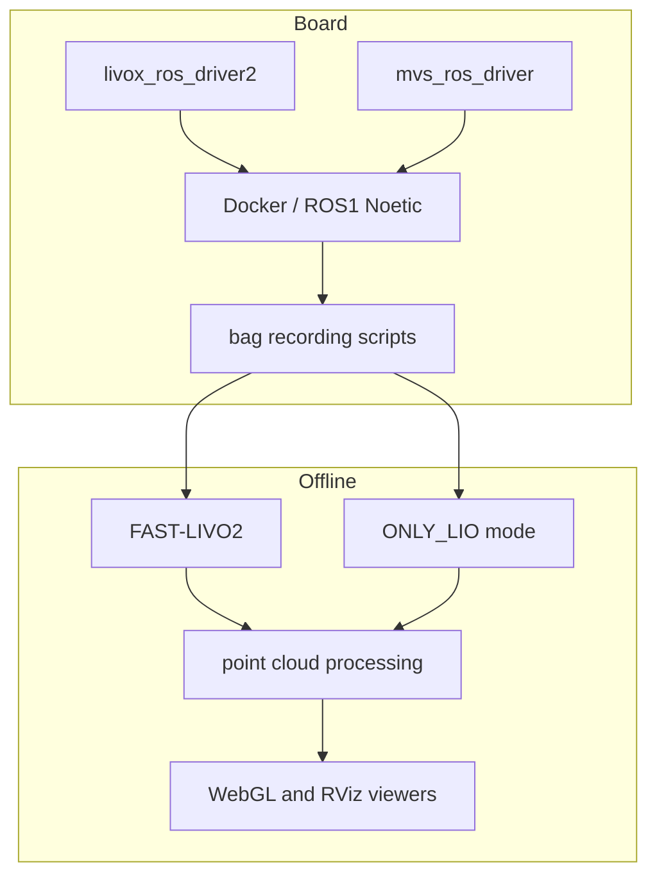

# Architecture

## Goal

The system targets embedded LiDAR-visual-inertial reconstruction on an RK3588/ELF2-class board. The practical design objective is to keep online acquisition simple and reliable, then run deterministic offline reconstruction from recorded ROS bags.

## Hardware Blocks

- Livox Mid-360 provides non-repetitive LiDAR packets and IMU measurements.
- Hikrobot MVS camera provides RGB images under external trigger mode.
- STM32 generates the hardware trigger pulse used by the camera synchronization path.
- RK3588/ELF2 runs ROS1 Noetic inside Docker with host networking.
- A workstation can be used for offline result inspection and WebGL delivery.

## Software Blocks

## Design Decision

The acquisition path records raw sensor topics only. FAST-LIVO2 is not run during the critical data collection step. This avoids coupling capture reliability to mapping CPU load and makes each reconstruction run reproducible.

## Key ROS Topics

- `/livox/lidar`: `livox_ros_driver2/CustomMsg`
- `/livox/imu`: `sensor_msgs/Imu`
- `/hikrobot_camera/rgb`: `sensor_msgs/Image`
- `/hikrobot_camera/camera_info`: `sensor_msgs/CameraInfo`

## Runtime Boundaries

The board-side runtime is optimized for acquisition and sensor drivers. Visualization products are generated offline from result directories. WebGL output is treated as a delivery artifact, not as a live dependency of mapping.
