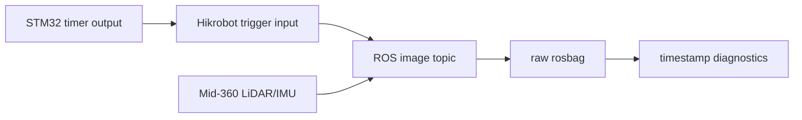

# Hardware Synchronization

## Purpose

Hardware synchronization is used to reduce timestamp drift between the camera stream and the LiDAR/IMU stream. In this project, the camera is configured in trigger mode and driven by an STM32 pulse output.

## Signal Path

## Diagnostics

The timestamp inspection utilities focus on:

- duplicate `header.stamp` values in image and camera_info messages
- large frame gaps in the camera stream
- topic rate consistency for LiDAR, IMU, image and camera_info topics
- continuity of reconstructed pose for static tests

For static tests, the expected pose trajectory should remain nearly fixed. A visible pose jump is treated as a mapping or synchronization symptom that needs investigation before judging point cloud quality.

## Practical Notes

The project keeps a LiDAR-only fallback path. If the camera trigger chain is unstable or unavailable, ONLY_LIO mode can still produce a pose trajectory and height-colored LiDAR reconstruction from Mid-360 LiDAR + IMU data.
