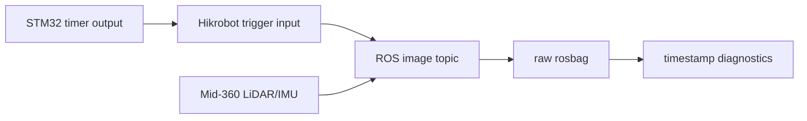

# Hardware Synchronization

## Purpose

Hardware synchronization is used to reduce timestamp drift between the camera stream and the LiDAR/IMU stream. In this project, the camera is configured in trigger mode and driven by an STM32 pulse output.

The code path is explicit:

- `07_full_source_code/mvs_ros_driver_elf2_hikrobot/include/hikrobot_camera.hpp` reads `TriggerEnable`, `TriggerMode`, `TriggerSource` and `LineSelector` from the ROS parameter tree.
- `07_full_source_code/mvs_ros_driver_elf2_hikrobot/config/camera.yaml` and `07_full_source_code/mvs_ros_driver_project_config/config/left_camera_trigger.example.yaml` set `TriggerMode: 1`, `TriggerSource: 0` and `LineSelector: 0` for the project trigger setup.
- The driver prints the configured trigger values at startup. The exact mapping from numeric SDK enum values to a physical line must be verified on the target Hikrobot camera through the MVS feature tree or vendor documentation.
- `07_full_source_code/mvs_ros_driver_elf2_hikrobot/src/hikrobot_camera.cpp` publishes `/hikrobot_camera/rgb` as `RGB8` and fills `/hikrobot_camera/camera_info` from the saved K/D/R/P calibration values.

## Signal Path

## Diagnostics

The timestamp inspection utilities focus on:

- duplicate `header.stamp` values in image and camera_info messages
- large frame gaps in the camera stream
- topic rate consistency for LiDAR, IMU, image and camera_info topics
- continuity of reconstructed pose for static tests

For static tests, the expected pose trajectory should remain nearly fixed. A visible pose jump is treated as a mapping or synchronization symptom that needs investigation before judging point cloud quality.

## Practical Notes

The project keeps a LiDAR-only fallback path. If the camera trigger chain is unstable or unavailable, ONLY_LIO mode can still produce a pose trajectory and height-colored LiDAR reconstruction from Mid-360 LiDAR + IMU data.

ROS image timestamps are assigned when the image is published. They are suitable for ROS-side approximate alignment diagnostics but should not be described as strict hardware exposure timestamps unless additional hardware timestamp or synchronization-error evidence is supplied.
